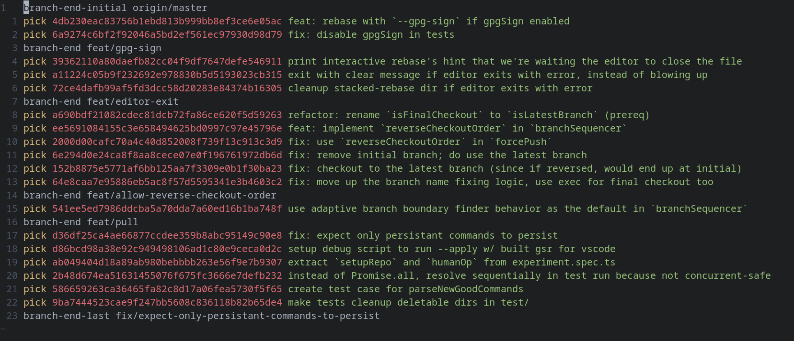

# git-stacked-rebase

stacked diffs in git, seamlessly.

<div align="center">
	</img>
	<p>
		<code>git-stacked-rebase</code>
		is like <code>git rebase -i</code>,
		but it allows you to rebase stacked branches as well.
	</p>
</div>

previously, if you wanted to adopt a stacked branch workflow, you'd have to do a lot of manual work every time you'd update anything in your stack -- jump thru each branch, re-rebase it on top of the previous one, get rid of duplicate commits, resolve conflicts, try to remember what the next branch was, and repeat...

there must be a better way. and that's exactly how git-stacked-rebase came to be. 

a branch is just a reference to some commit (literally, it's a single-line file that contains a 40-character commit SHA -- check your `.git/refs/` folder). why not just work on your latest feature branch, rebase comfortably, and then have your tool automatically update the partial branches to make them point to the correct new commits?

from those partial branches, you can create pull requests. with this workflow, you get to comfortably iterate in a single branch; your teammates get the benefits of reviewing smaller PRs (when they're ready). win win. that's _literally_ all.

---

`git-stacked-rebase` is not specific to any host like github or gitlab. it's "specific" to `git` itself.

it's not only a CLI either - it's first and foremost a javascript library, and the CLI is just a tool that builds on top of the library.

in the future, we could create host-specific adapters. they could be used to automate some simple tasks, such as creating a pull request, or changing the base branch of a pull request, etc.

there are bigger plans as well, such as creating a browser extension to improve the experience of exploring stacked PRs.

## Progress

follow [http://kiprasmel.github.io/notes/git-stacked-rebase.html](http://kiprasmel.github.io/notes/git-stacked-rebase.html)

## Setup

dependencies:

- [node.js](https://nodejs.org/en/)
- git
- something else i probably forgot

```sh
npm i -g git-stacked-rebase

# optional:
git config --global alias.stacked-rebase git-stacked-rebase
git config --global alias.rr             git-stacked-rebase
```

## Usage

```sh
cd repo/

# checkout your remote branches locally (until we automate it w/ a command?). 
# then, checkout to the latest one.
# then:

git-stacked-rebase --help
```
